  

  🎓 M.S. Computer Engineering, <b>NYU Tandon</b> (December 2026)  
  ☕ Fueled by Coffee | Driven by Curiosity | Guided by Code

---

### 💫 About Me

Since childhood, I've been determined to pursue a career in **Computer Science**, a journey built on curiosity, problem-solving and perseverance.

Today I build **machine learning systems** that turn messy, real-world data into something people can trust, and I care just as much about how those systems **look and feel** to use. My work sits where **ML infrastructure**, **computer vision** and **design** meet: training and running models efficiently, getting reliable structure out of chaotic inputs, and shaping interfaces and 3D models that make complex things clear.

---

### 🚀 Highlights

- 📜 **Vision-Language Document Pipeline** · *NYU Faber Lab*
  Built an OCR pipeline with **Qwen2.5-VL** that transcribed **73,441 historical mortgage records (~150,000 page images)** for housing-discrimination research, running **6 concurrent GPU jobs on SLURM** and finishing all 30 batches in about 2 weeks.

- ⚡ **LLM Fine-Tuning Efficiency Benchmark**
  Compared **LoRA, QLoRA, GoRA and gradient checkpointing** on Qwen2.5-1.5B. GoRA gave **~15% higher throughput**, and **Nsight** profiling traced it to GPU utilization rising from **4.2% to 70.3%**.

- 🚁 **Drone-Assisted Crack Detection**
  **YOLOv8** infrastructure inspection with a hand-annotated dataset, benchmarked against **Faster R-CNN**.

- 🌍 **UNESCO Data Governance Tool** · *The GovLab*
  Designed and built a live self-assessment **PWA** (56 questions, 4 dimensions) adopted for course use, with direct positive feedback from UNESCO.

---

### 🛠️ Built Projects With

- 🤖 **PyTorch, Hugging Face PEFT, LoRA / QLoRA, Vision-Language Models**
- 👁️ **YOLOv8, Faster R-CNN, OpenCV, Tesseract OCR (Computer Vision)**
- ⚙️ **HPC / SLURM, Distributed Training, Nsight, Docker, Linux**
- 📊 **Big Data & Machine Learning (PySpark)**
- ⚡ **Core JavaScript** · 💅🏽 **Core CSS** · 🐚 **Python Flask**
- 🎨 **UI Design & Progressive Web Apps**
- 🧊 **3D Design & CAD** · NYU Hyperloop Electrical & CAD team
- 🧩 **RISC-V Simulator (Architecture Project)**

---

### 🌱 Currently Exploring

- 🤖 **AI Agents & Intelligent Automation**
- ⚡ **Efficient Inference & Model Optimization**
- 🎨 **Where 3D, UI and ML meet**

---

### 🧡 Fun Bits About Me

- ☕ I'm a **coffee addict**, code and caffeine go hand in hand!
- 🎨 A strong believer that design and functionality must go together.
- 💬 Always open to learning, collaborating and exploring innovative ideas.

---

### 💼 Connect With Me

  
  
  
  
  

---

<h3 align="center">🚀 "Building cool things with code, one cup of coffee at a time." ☕</h3>

  

  

  

